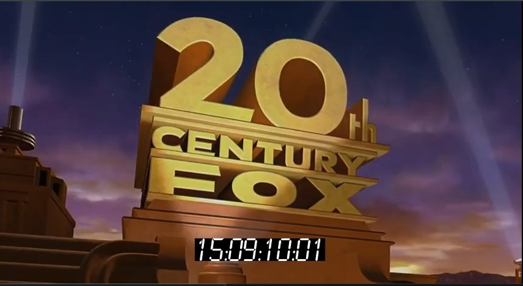

# timecode-stamp
Batch add timecode stamps to videos
<p align="left">
  </a>
</p>

# Description
A python script which can add a timecode stamp to a video. The timecode as well as required video information are loaded from a CSV file, created from scratch or exported from the [Tentacle Timecode Tool](https://tentaclesync.com/timecode-tool). This little freeware can extract timecode recorded on the audio track from multiple videos and export it as CSV.

The videos are re-encoded using ffmpeg. The script can work as a batch, by loading videos from multiple entries in the CSV file.

# Requirements
See requirements.txt
Additionnaly you will need [ffmpeg](https://www.ffmpeg.org/download.html) installed and running on your PC. You should already, as it's an amazing tool! Tons of tutorials online to install it.

# Use
Simply call the timecode_stamp function with following arguments:
* video_dir (mandatory): Path to directory containing video files
* csv_file (mandatory): Path to csv file containing timecode and video information
* out_dir (optional, 'out_TC' by default) output directory
* font_path (optional, font.ttf by default) path to font
* font_factor (optional, 25 by default) font size factor (video height / value), the higher the value, the smaller the font size
* open_dir (optional, True by default) opens output directory at the end

# Example
```python
video_dir = os.path.join(os.path.dirname(os.path.abspath(__file__)), "medias")
csv_file = os.path.join(video_dir, 'tc.csv')

timecode_stamp(video_dir, csv_file, out_dir = None, font_path = 'font.ttf', font_factor = 25, open_dir = True)
```
