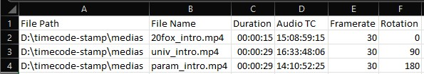

# timecode-stamp
Batch add timecode stamps to videos
<p align="center">
  </a>
</p>

# Description
A python script which can add a timecode stamp to a video. The timecode as well as required video information are loaded from a CSV file, created from scratch or exported from the [Tentacle Timecode Tool](https://tentaclesync.com/timecode-tool). This little freeware can extract timecode recorded on the audio track from multiple videos and export it as CSV.

<p align="center">
  </a>
</p>

Required columns are *File Name*, *Audio TC* and *Video Framerate*. An optional Rotation column can be added to rotate the video during encoding. Supported values are -90, 90 and 180. Leave blank or 0 for no rotation.

The videos are re-encoded using ffmpeg. The script can work as a batch, by loading videos from multiple entries in the CSV file.

# Requirements
See requirements.txt

Additionnaly you will need [ffmpeg](https://www.ffmpeg.org/download.html) installed and running on your PC. You should already, as it's an amazing tool! Tons of tutorials online to install it.

The script is running in Python 2.7 and 3.8 environments.

# Use
Simply call the timecode_stamp function with following arguments:

REQUIRED:
* **video_dir**: Path to directory containing video files
* **csv_file**: Path to csv file containing timecode and video information

OPTIONAL:
* **out_dir** ('out_TC' by default) output directory
* **font_path** (font.ttf by default) path to font
* **font_factor** (25 by default) font size factor (video height / value), the higher the value, the smaller the font size
* **overwrite** (False by default) overwrite video files in the output folder if they already exist
* **open_dir** (True by default) opens output directory at the end

# Example
```python
video_dir = os.path.join(os.path.dirname(os.path.abspath(__file__)), "medias")
csv_file = os.path.join(video_dir, 'tc.csv')

timecode_stamp(video_dir, csv_file, out_dir = None, font_path = 'font.ttf', font_factor = 25, overwrite = True, open_dir = True)
```
